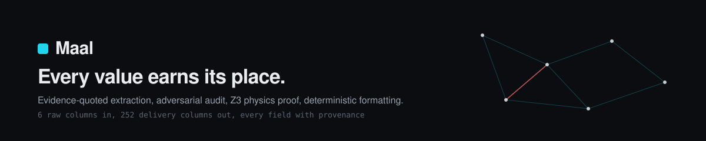
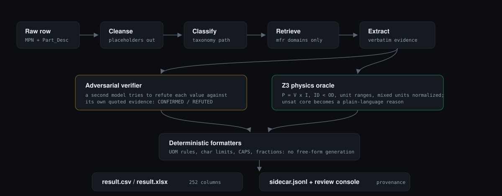

<p align="center">
  
</p>

# Maal

Maal turns messy industrial catalog rows into complete, commerce-ready product records.
Every value is extracted with a verbatim evidence quote, audited by an adversarial LLM pass,
proved physically possible by a Z3 oracle, formatted deterministically to house style, and
exposed in a review console with per-field provenance.

Built for the Unilog challenge: 6 raw input columns (`Mfg_Part_Num`, `Part_Desc`, brand
placeholders, supplier) become all 252 Delivery Format columns.

**Live demo:** https://maal-seven.vercel.app (precomputed snapshot; run locally for live enrichment).

## How it works

<p align="center">
  
</p>

Two independent skeptics sit between extraction and output. The adversarial verifier tries to
refute each value against its own quoted evidence. The Z3 oracle asserts every number as a
tracked assumption and, when the set is impossible, returns the exact unsat core translated
into a plain-language reason. Nothing free-generates: formatters are deterministic, so a value
either carries provenance or is flagged, never invented.

## Quickstart

```bash
cd maal
python3 -m venv .venv
.venv/bin/pip install google-genai pydantic pandas openpyxl z3-solver httpx ddgs pytest pytest-asyncio
cp .env.example .env    # add your Gemini API key
```

| `.env` key | Purpose |
|---|---|
| `GEMINI_API_KEY` | Google AI Studio key (free tier works) |
| `GEMINI_MODEL` | Primary model, e.g. `gemini-3.1-flash-lite` |
| `GEMINI_MODEL_FALLBACKS` | Comma list; fails over when a model's daily quota runs out |
| `EXTRACT_BATCH` | Rows per extraction call (default 8) |
| `RPM_LIMIT` | Requests per minute throttle (default 15) |

## Run the pipeline

```bash
# smoke: first 10 rows
PYTHONPATH=src .venv/bin/python -m pipeline.run_batch --limit 10 --no-resume

# full catalog from a given input file
PYTHONPATH=src .venv/bin/python -m pipeline.run_batch --input path/to/input.csv --no-resume

# resume an interrupted run (drop --no-resume)
PYTHONPATH=src .venv/bin/python -m pipeline.run_batch

# no API key? generate honest demo artifacts offline (input-derived, all flagged UNVERIFIED)
```

Outputs land in `output/`:

| File | Contents |
|---|---|
| `result.csv` / `result.xlsx` | All 252 Delivery Format columns |
| `sidecar.jsonl` | Per-field source URL, verbatim quote, trust tier, adversarial verdict, confidence, Z3 checks, triage score |
| `state.jsonl` | Checkpoint; reruns skip completed rows |
| `corrections.jsonl` | Human fixes, applied on the next run |

Retrieval is cached per supplier+MPN and every LLM response is cached by prompt hash, so
identical prompts across runs cost zero tokens (`LLM_CACHE=0` disables). On the free tier the
runner batches rows, skips audits with no manufacturer evidence, fails over across models, and
stops gracefully when every daily budget is spent; rerunning continues where it stopped. A
daily auto-resume job ships in `deploy/com.maal.pipeline.plist`.

## Architecture (production)

```
GitHub ──push──► Vercel (Next.js portal)   ──POST /enrich──►  Render (FastAPI)
                 serves UI + snapshot data                   full Python pipeline:
                                                             Z3 physics, Jina Reader
                                                             retrieval, Gemini stages
```

- **Render service**: FastAPI wraps the real pipeline. Create a Web Service
  from this repo — Build: `pip install -r backend/requirements.txt` ·
  Start: `uvicorn backend.main:app --host 0.0.0.0 --port $PORT` ·
  Env: `GEMINI_API_KEY`. Copy its `*.onrender.com` URL.
- **Vercel env**: `BACKEND_URL = <the Render URL>` (plus `GEMINI_*` optional).
  Pushes to master auto-deploy both services.
- Backend endpoints: `GET /health`, `POST /enrich/single`,
  `POST /enrich/batch` (CSV ≤10 rows).

## Web console

```bash
cd web && npm install && npm run build && npm start   # http://localhost:3000
```

| Page | What it does |
|---|---|
| Dashboard | Live stats and recent runs, entry points |
| Enrich | Single row or `.csv`/`.xlsx`/`.tsv` upload; column names auto-detected |
| Job | Live progress; expand each record for per-attribute provenance; download exactly what you uploaded |
| Catalog | Risk-ranked triage queue: filter chips, verdict stamps, downloads |
| Row detail | Five description formats with live char counts, attribute ledger with QC stamps like `[MFR DOC / CONFIRMED / 0.75]`, expandable evidence quotes, Z3 dossier with plain-language unsat reasons |
| Compare | Side-by-side diff against the labelled expected output |

Corrections made in the UI land in `output/corrections.jsonl`; the next pipeline run applies
them and marks the field verified by human.

## Score and test

```bash
# format compliance: header fidelity, char limits, CAPS rule, UOM spacing, fractions,
# replay diff vs the two labelled example rows
PYTHONPATH=src:. .venv/bin/python eval/score.py output/result.csv

# recompute flags/triage from checkpoints, zero API calls
PYTHONPATH=src:. .venv/bin/python eval/rescore.py

# 75 tests: cleansing, UOM/fraction math, descriptions, emit fidelity, Z3 constraint
# families (incl. mixed-unit normalization), adversarial policy, failover, e2e with mocked LLMs
PYTHONPATH=src:. .venv/bin/python -m pytest tests/ -q
```

## Sourcing policy

Product data comes only from manufacturer-owned domains (site = trust 1.0, manufacturer-hosted
PDFs = 0.9). Marketplaces and distributor sites are excluded and flagged. When nothing can be
verified, values stay input-derived and flagged, never fabricated.

## Layout

```
src/pipeline/    enrichment stages, formatters, runner
web/             Next.js review console
eval/            compliance scorer + offline rescore
input/           sample dataset + expected-output headers
docs/            ops runbook, design brief, audit
```
